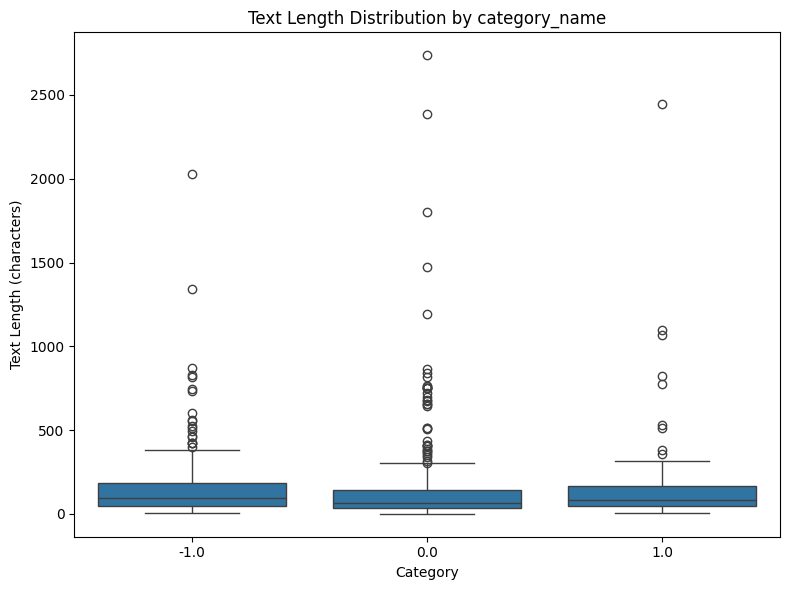
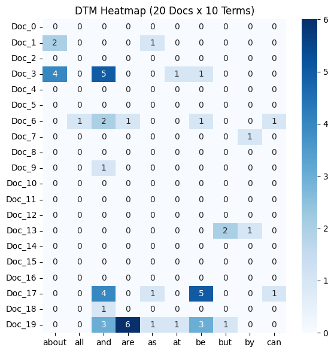
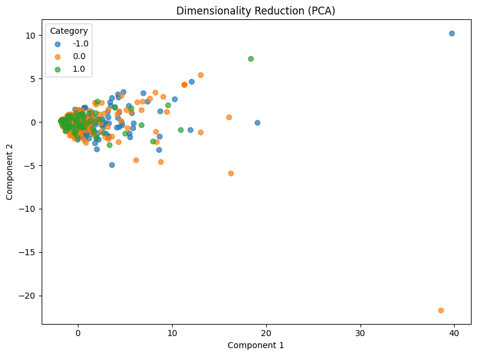

# Analysis Report on Reddit Stock Sentiment Dataset Exploration

In this assignment, I applied the eighteen custom tools built earlier to test their generalization on `newdataset/Reddit-stock-sentiment.csv`. Loading the dataset via `load_dataset_1` yielded 847 posts in total, categorized into three sentiment labels: neutral (0.0, 423 rows), negative (-1.0, 315 rows), and positive (1.0, 109 rows). Running `check_missing_3` verified that there were zero missing values. Although `check_duplicates_4` detected 23 duplicate text rows, they were kept to preserve the original distribution, and `inspect_data_2` confirmed a clean dataset structure of 847 rows and 3 columns.

During the exploratory data analysis phase, I evaluated character length distributions using `describe_data_5`. The average post length across the dataset was 147.44 characters (median: 78.0, standard deviation: 238.27). Interestingly, positive comments had the longest average length (163.27 characters), followed by negative comments (152.82 characters), whereas neutral comments were noticeably more concise (139.37 characters). The boxplot below illustrates the text length dispersion across these three categories

For text preprocessing, `tokenize_6` was performed to extract 26,386 tokens across 4,534 unique vocabulary terms, averaging roughly 31.15 tokens per post. Next, `build_dtm_7` constructed a document-term matrix based on 50 representative terms, showing a sparsity of 87.62%. Frequency aggregation via `term_frequency_8` identified the most prevalent words as grammatical function words, including the(920 times), to(566 times), and and(488 times). A positional slice of the matrix was then visualized using `dtm_heatmap_9` to observe the localized distribution of the top 10 terms across sample documents

Moving to feature analysis and filtering, `feature_correlation_10` revealed moderate to high positive correlations between common syntactic words (e.g the and in showed a correlation of 0.6943). Filtering with `variance_filter_11` at a variance threshold of 0.01 retained all 50 terms. However, applying `pearson_filter_12` against the negative sentiment class with a threshold of 0.1 filtered the feature set down to just 7 words`['he', 'will', 'trump', 'china', 'us', 'has', 'be']`. This aligns intuitively with retail market discourse, where bearish sentiment often revolves around geopolitical events and political figures. Subsequent frequent pattern mining via `mine_patterns_13` produced no multi-term itemsets, likely due to the short and sparse nature of forum posts.

Finally, `reduce_dimensions_14` was executed using PCA to project the feature space down to 2 dimensions for visualization. The first two principal components accounted for over 55% of the total variance (48.18% for PC1 and 7.24% for PC2). The resulting scatter plot shows samples densely clustered near the origin with distinct directional outliers along the axes, confirming that the entire tool pipeline generalizes effectively to a multi-class sentiment task

